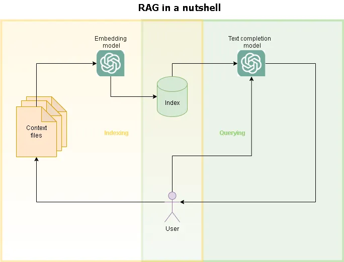

One of the initial limitations of Large Language Models (LLMs) relies on the limited space they were trained on. So despite the capabilities those models exhibite, they can only generate text based on the universe of written communications used to train that particular model. So how can we use those LLMs to work with unseen data?

## Retrieval Augmented Generation

LLMs are models especialized on text prediction, they can be seen as the evolved form of the autocomplete features of our keyboards. They are very good predicting text because of advances in the Natural Language Processing (NLP) techniques and modelling especially with the transformers architecture [1](https://doi.org/10.48550/arXiv.1706.03762). They are so good because there are plenty of written examples that were used to train those models, so if you start writing something (a prompt) those models can predict efficiently how you can continue that text. In simple terms you can see an LLM as a black box that completes text using a prompt.

A very useful application of those models implies completion of that text using a very delimited context instead of using the whole universe of texts used in the training processes. That is precisely the focus of the Retrieval Augmented Generation (RAG). RAG relies on providing a set of text to retrieve important context, then complete (augment) the text, generating a very specific response that uses the context provided.




### Indexing phase

At the indexing phase the main purpose is to build a context base that the LLM can use to complete their tasks. But hoe to build that context base? You probably would require to use a model that can map simple text into machine usable format. A very common way to do that is using embeddings which are vectorial representations of the meaning or the semantics of a piece of text. Transfrom a text into an embedding is a well known NLP technique that relies on the usage of an embedding model that can translate text into an embedding.


### Query phase

The queryng phase requires an index, to gather all the context to build a new answer. However, the crucial part is retrieve only the most relevant information required for a particular prompt, so you will need a systematic way to compare indexed texts to use only the most relevant, and embeddings are particularly useful for this since they contains the meaning enconded as in vectors, which can be compared using distance metrics to pick the nearest, _aka_ the most relevant context. Then that context can be added to the prompt so that an LLM can use the specific context to generate and augment a new response.


```bash
curl -sSL https://install.python-poetry.org | python3 -
poetry --version
```

```bash
pip install cookiecutter # you can also use conda to encapsulate this
```


Then you are ready to call for the [Data Science template](https://github.com/rgalindor/data-science-cookiecutter):

```bash
cookiecutter https://github.com/rgalindor/data-science-cookiecutter --checkout main
```

This would prompt you to set interactively a new `git` repository. Once you finnished the setup you would be able to install the base dependencies and start working on your new environment.

```bash
cd <your-local-repo>
poetry install
```


And thats it! You can start to create your own models and starting their lifecycle!

> [Photo](https://www.pexels.com/photo/a-scrabble-board-with-the-letters-a-and-a-18548425/) by Markus Winkler from Pexels